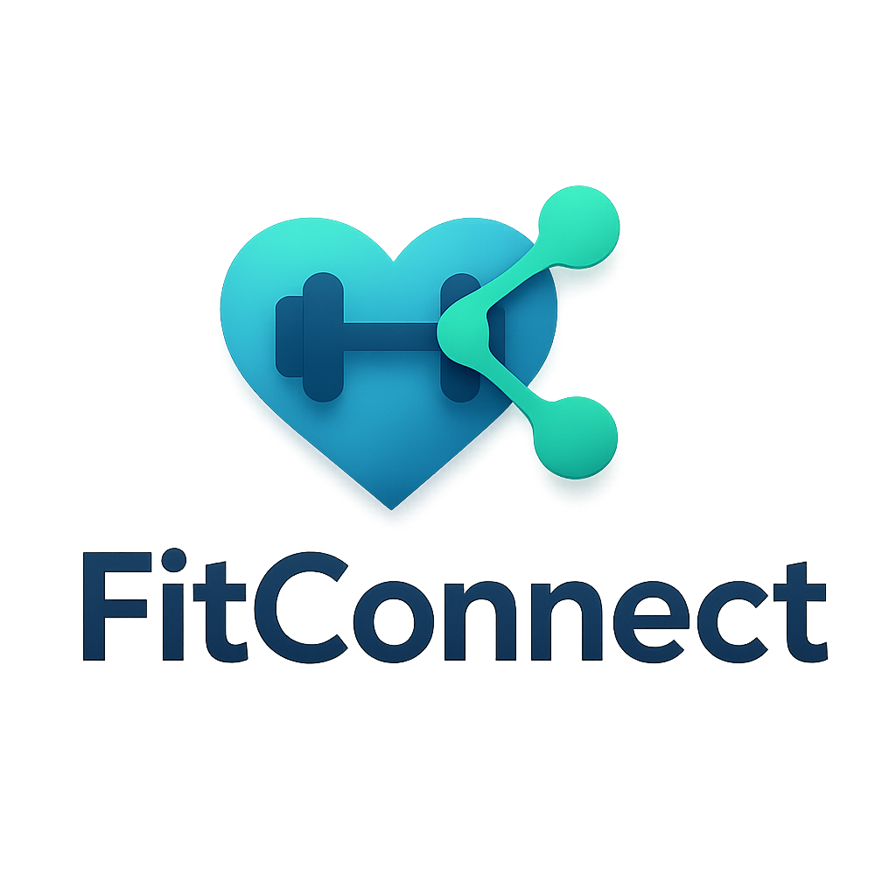

# FitConnect

<p align="center">
  
</p>

<p align="center">
  A modern fitness connection application that helps users book fitness sessions and manage their fitness journey.
</p>

## Overview

FitConnect is a comprehensive fitness management application designed to connect users with fitness sessions and help them track their fitness journey. The app allows users to browse available fitness sessions, book appointments, manage their membership, and track their payment history.

## Features

- **User Authentication**: Secure login and signup with Firebase Authentication
- **Session Booking**: Browse and book fitness sessions (Yoga, Gym, Zumba)
- **Membership Management**: Purchase and manage premium memberships
- **Payment Integration**: Secure payments through Razorpay payment gateway
- **Booking History**: Track past bookings and attendance
- **Payment History**: View payment transactions and status
- **QR Code Generation**: Generate QR codes for session attendance
- **Profile Management**: Update user profile and preferences

## Tech Stack

- **Frontend**: Flutter (Dart)
- **Backend**: Firebase
  - Firebase Authentication
  - Cloud Firestore
- **Payment Gateway**: Razorpay
- **State Management**: Provider
- **UI Components**: Material Design

## Installation

### Prerequisites

- Flutter SDK (>=3.2.3)
- Dart SDK (>=2.19.0)
- Android Studio / VS Code
- Firebase project setup

### Setup Instructions

1. **Clone the repository**
   ```bash
   git clone https://github.com/yourusername/fitconnect.git
   cd fitconnect
   ```

2. **Install dependencies**
   ```bash
   flutter pub get
   ```

3. **Configure Firebase**
   - Create a new Firebase project
   - Add Android and iOS apps to your Firebase project
   - Download and place the `google-services.json` (Android) and `GoogleService-Info.plist` (iOS) files in the appropriate directories
   - Enable Authentication and Firestore in your Firebase console

4. **Configure Razorpay**
   - Update the Razorpay API keys in `lib/utils/constants.dart`
   ```dart
   static const String razorpayKeyId = 'YOUR_RAZORPAY_KEY_ID';
   static const String razorpayKeySecret = 'YOUR_RAZORPAY_KEY_SECRET';
   ```

5. **Generate splash screen and app icons**
   ```bash
   flutter pub run flutter_native_splash:create
   flutter pub run flutter_launcher_icons
   ```

6. **Run the app**
   ```bash
   flutter run
   ```

## Project Structure

```
lib/
├── main.dart                  # Entry point of the application
├── models/                    # Data models
├── screens/                   # UI screens
│   ├── auth/                  # Authentication screens
│   ├── booking_screen.dart    # Session booking screen
│   ├── booking_history_screen.dart  # Booking history screen
│   ├── membership_screen.dart # Membership management screen
│   ├── payment_screen.dart    # Payment screen
│   ├── profile_screen.dart    # User profile screen
│   └── razorpay_payment_screen.dart # Razorpay integration screen
├── services/                  # Business logic and services
│   ├── auth_service.dart      # Authentication service
│   ├── booking_service.dart   # Booking service
│   └── payment_service.dart   # Payment service
├── utils/                     # Utility functions and constants
│   ├── config.dart            # App configuration
│   └── constants.dart         # App constants
└── widgets/                   # Reusable UI components
```

## Firebase Collections

### `users` Collection
- User profiles and authentication data
- Fields: name, email, membership_active, membership_expiry

### `booking` Collection
- Fitness session bookings
- Fields: userId, type, date, time, attendance, created_at

### `transactions` Collection
- Payment transaction records
- Fields: user_id, amount, status, payment_id, description, created_at

## Screenshots

<p align="center">
  
  
  
  
</p>

## Future Enhancements

- Instructor profiles and ratings
- In-app messaging between users and instructors
- Fitness progress tracking
- Social features (sharing achievements, group sessions)
- Personalized workout recommendations

## Contributors

- [Your Name](https://github.com/yourusername)

## License

This project is licensed under the MIT License - see the [LICENSE](LICENSE) file for details.

## Acknowledgements

- [Flutter](https://flutter.dev/)
- [Firebase](https://firebase.google.com/)
- [Razorpay](https://razorpay.com/)
- [Provider](https://pub.dev/packages/provider)
- [Flutter Native Splash](https://pub.dev/packages/flutter_native_splash)
- [Flutter Launcher Icons](https://pub.dev/packages/flutter_launcher_icons)